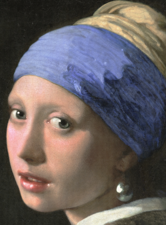
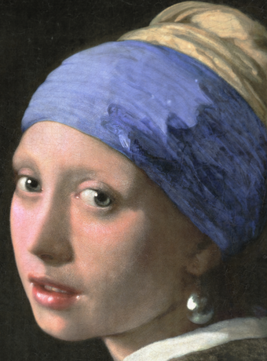
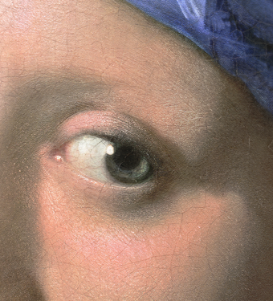
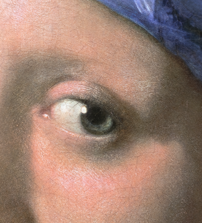
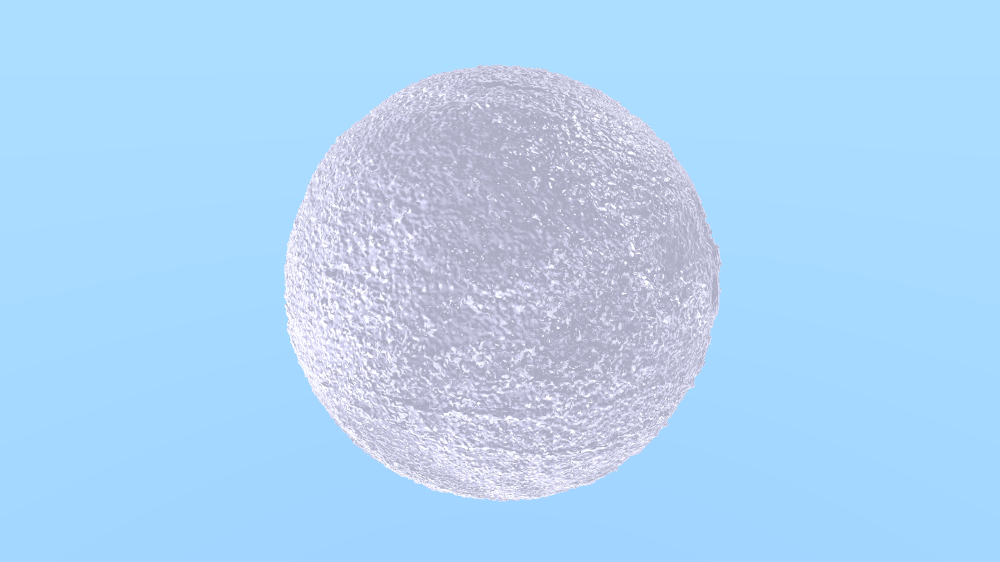

# TinyFuseML

A neural rendering framework capable of training and rendering ultra-high-resolution images using a trainable multiresolution hash encoding.

It also supports 3D SDF training and rendering, with a built-in volumetric renderer for visualizing SDFs. Currently, custom SDF input is not yet supported.


### Example — 1080p Default Image Training (2.6 seconds)

| Original | Training Result |
|----------|----------|
|  |  |

## Example — 470 Megapixel Rendering

The following is a comparison of the original 20000 × 23466 (~470 megapixel)  
"Girl With Pearl" image and the neural rendering result.
| Original | Training Result |
|----------|----------|
|  |  |
|  |  


### Features

- Train 470 megapixel images in ~7 minutes on a GTX 1080
- Train 1080p images in under 3 seconds
- Trainable multiresolution hash grid encoding
- Custom command line parameters
- 3D SDFs rendering example (no custom input yet)
- basic volumteric renderer for visualizing 3D SDFs
- Automatic example run via the build script

### Example — Experimental 3D SDF Training (21.2 seconds)

 Training Result |
|----------|
|  |

## Getting Started 

### Build and Run

Build the project and run a training example:

```bash
./build.sh
```

The trained image will be inside the **build** folder as **Full_Inference.png**

Make sure you have:

- CUDA Toolkit 11.8 or newer
- GCC/G++ 11 (set in CMakeLists.txt)
- OpenCV installed
- CMake 3.18 or newer

### Requirements

- **CUDA Toolkit 11.8+**  
  Required for GPU-accelerated training and rendering. Tested with CUDA 11.8.
- **NVIDIA GPU with Compute Capability ≥ 6.1**  
  GTX 1080 or newer recommended.
- **GCC/G++ 11 or newer**  
- **OpenCV**
- **CMake 3.18+**  

### Ubuntu Example Install

```bash
# Install GCC/G++ 11
sudo apt install gcc-11 g++-11

# Install OpenCV
sudo apt install libopencv-dev

# Install CMake
sudo apt install cmake

# CUDA Toolkit: Download and install from NVIDIA
```

## Running with Custom Parameters

After building, you can run the program manually with optional arguments:
```bash
./tinyfuseml [--mode image|sdf] [--image <path>] [--steps <int>] [--loss <float>] [--res <width> <height>] [--hashres <int>] [--lr <float>] [--hashlr <float>] [--help]
```
- **image** - path to the input image, default is **images/cassette_shop_fullhd.png**
- **steps** - maximum number of training steps
- **loss** - batch loss threshold for stopping
- **res** - output resolution
- **lr** - MLP learning rate
- **hashres** - base resolution of the hash encoding
- **hashlr** - base learning rate of the hash encoding
- **mode** - training mode, default is image training

Example: 
```bash
# Train a custom image
./tinyfuseml --image images/my_image.png --steps 500 --loss 0.0003
```

```bash
# Train in SDF mode (sphere example)
./tinyfuseml --mode sdf --steps 400
```

### Help

```bash
./tinyfuseml --help
```
Displays usage information

## Performance Notes

- Built and tested on the GTX 1080
- 470+ megapixel images can be trained and rendered in ~7 minutes, tested on the 20000 x 23466 "Girl With Pearl" image **http://profoundism.com/free_licenses.html**
- For higher resolution image training, increase **N_LEVELS** and **LOG2_HASHMAP_SIZE** from the **hash_encoding.cuh** file 
- In case of numerical instability, try lowering the MLP learning rate
- For further quality improvements, increasing **hiddenSize1** and **hiddenSize2** (MLP hidden layers) to 32 may help, but **threadsPerBlock** might need to be reduced in **main.cu**

## Acknowledgements

- Inspired by [Instant-NGP](https://nvlabs.github.io/instant-ngp/)
- "Girl With Pearl" image provided under free license from [Profoundism](http://profoundism.com/free_licenses.html)


